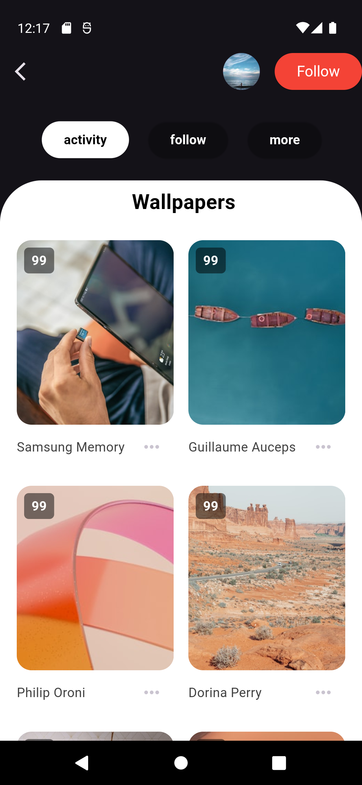
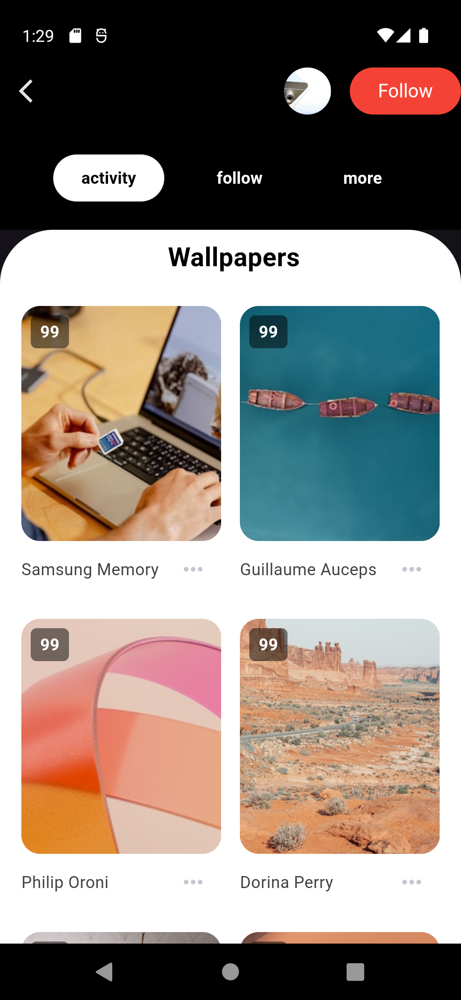
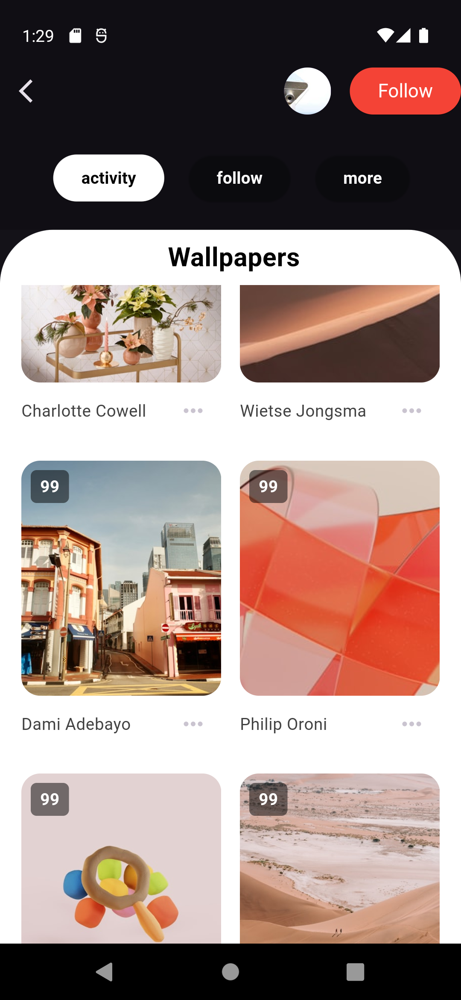
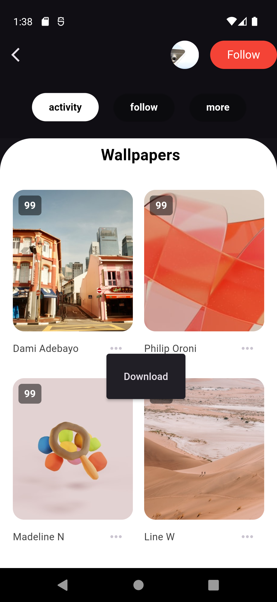
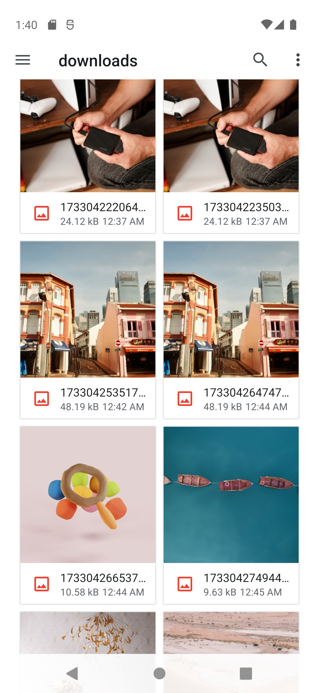
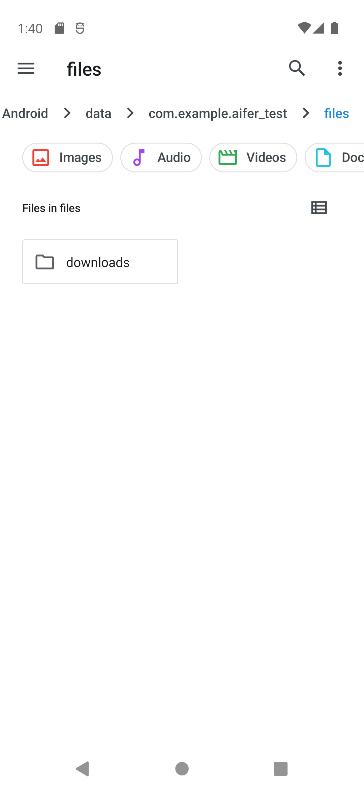

Steps to Set Up the Project
Clone the Repository

bash
Copy code
git clone https://github.com/divyeshp07/aifer_test.git  
cd aifer_test  
Install Dependencies
Fetch the required dependencies:

bash
Copy code
flutter pub get  
Generate Model Classes
The project uses build_runner for generating data models. Run the following command to generate files:

bash
Copy code
dart run build_runner build  
If you encounter conflicts, use:

bash
Copy code
dart run build_runner build --delete-conflicting-outputs  
Run the Project
Start the app on an emulator or a connected device:

bash
Copy code
flutter run  
Project Structure
controller/: Manages state and providers.
view/pages/: Contains application screens.
view/widgets/: Reusable UI components.
models/: Data models with code generation support.
Features
Dynamic UI: A responsive and visually appealing interface.
Riverpod State Management: Efficient and reactive state handling.
Code Generation: Immutable models and JSON serialization using build_runner.
Responsive Layouts: Ensures seamless experience across devices.
UI Screenshots
Wallpapers UI

